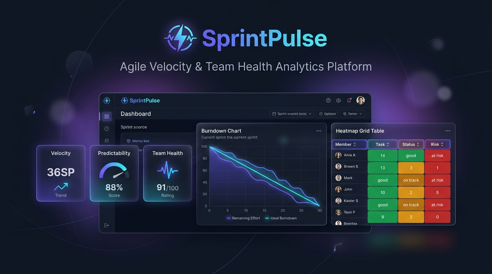

# SprintPulse: Agile Velocity & Team Health Analytics Platform

<div align="center">



# SprintPulse
### Agile Velocity & Team Health Analytics Platform

[](LICENSE)
[](https://developer.mozilla.org/en-US/docs/Web/HTML)
[](https://developer.mozilla.org/en-US/docs/Web/JavaScript)
[](https://www.chartjs.org/)
[](#how-to-run-locally)
[](https://sprintpulse-eight.vercel.app/)
[](https://www.sab.ac.lk)

**An enterprise-grade Agile Project Management & Sprint Analytics dashboard built for Associate IT Project Managers, Scrum Masters, and Engineering Leads.**

[**🚀 Live Demo**](https://sprintpulse-eight.vercel.app/) · [**PM Documentation Suite**](#it-project-management-documentation-suite) · [**Features**](#features) · [**Run Locally**](#how-to-run-locally)

</div>

---

## Executive Summary

Modern engineering teams lose sprint predictability to fragmented tools, silent scope creep, and invisible team burnout. **SprintPulse** closes this gap by delivering a single-file, zero-dependency analytics platform that surfaces what matters — velocity, predictability, risk, and team health — in one premium interface.

Built by a 3rd-year IT undergraduate at **Sabaragamuwa University of Sri Lanka (SUSL)** targeting an **Associate IT Project Manager (APM) / Scrum Master** internship, this project demonstrates:

- **Full-stack web engineering** — Vanilla JS SPA, modular architecture, Chart.js data visualisation.
- **Agile practitioner depth** — Monte Carlo forecasting, CFD/Little's Law, Planning Poker, RAID governance, Retrospective facilitation.
- **PM documentation maturity** — PMBOK/PMI-aligned project charter, PRD, system architecture, risk register, WBS, and sprint delivery reports.

---

## What This Demonstrates to a Hiring Manager

| Skill Area | Evidence in SprintPulse |
| :--- | :--- |
| **Agile / Scrum facilitation** | Standup Facilitator, Planning Poker, Retrospective Board, Sprint Comparison |
| **Data-driven PM** | Monte Carlo simulator (1k–10k runs), Burndown/Burnup, Velocity trending |
| **Risk management** | Automated risk radar, 5×5 RAID Log with severity scoring |
| **Kanban & flow** | Cumulative Flow Diagram, Little's Law WIP simulator |
| **Stakeholder reporting** | One-click executive report (Markdown → PDF/Slack/Email ready) |
| **Team health monitoring** | Performance Heatmap (utilisation %, overallocation, consistency scores) |
| **Technical initiative** | Zero-build SPA, localStorage persistence, JSON workspace backup |
| **Documentation** | Full PMBOK-aligned doc suite: Charter, PRD, Architecture, RAID, WBS, Sprint Reports |

---

## Features

### Core Analytics

| # | Module | Description |
| :- | :--- | :--- |
| 1 | **Sprint Analytics Dashboard** | Composite Health Index, interactive burndown/burnup, velocity trend, scope creep index |
| 2 | **Automated Risk Radar** | Heuristic engine detecting overallocation, PR review bottlenecks, scope volatility with remediation steps |
| 3 | **Sprint Task Board** | Drag-and-drop Kanban board (To Do → In Progress → In Review → Done) |
| 4 | **Monte Carlo Simulator** | 1,000–10,000 probabilistic simulations; P95/P85/P50/P15 delivery confidence intervals |
| 5 | **Kanban CFD & Little's Law** | Multi-stage queue visualisation + interactive WIP limit simulator (Lead Time = WIP ÷ Throughput) |

### Agile Ceremonies

| # | Module | Description |
| :- | :--- | :--- |
| 6 | **Daily Standup Facilitator** | 15-minute timeboxed ceremony; 2-min speaker rotation; parking lot; 1-click RAID escalation |
| 7 | **Retrospective Board** | 3-column board (Went Well / Needs Improvement / Action Items) with upvoting & local persistence |
| 8 | **Planning Poker** | Fibonacci deck (1–21, ?, Pass); simulated squad voting; consensus calculation |
| 9 | **RAID Log Manager** | Filterable register; 5×5 Likelihood×Impact scoring; modal entry forms; category badges |

### Portfolio & Reporting

| # | Module | Description |
| :- | :--- | :--- |
| 10 | **Executive Report Generator** | One-click stakeholder briefing in Markdown; print-to-PDF layout |
| 11 | **PM Artifacts Viewer** | In-app reader for all 7 project management documents |

### Advanced Data Tools

| # | Module | Description |
| :- | :--- | :--- |
| 12 | **Custom Squad Builder** | 5-step wizard — squad info, members, sprint config, task backlog, launch |
| 13 | **Jira CSV Importer** | Drag-and-drop CSV parser; auto-detects Issue Key/Summary/Status/SP/Assignee columns; live preview |
| 14 | **Sprint Comparison View** | Side-by-side sprint analysis: burndown overlay, velocity bars, delta KPI cards (velocity, predictability, scope creep, health) |
| 15 | **Team Performance Heatmap** | Member × Sprint utilisation grid; colour-coded load (green/amber/red); trend chart; member drill-down |
| 16 | **JSON Workspace Export & Import** | Full workspace backup (all squads, RAID, retros, theme) to one `.json` file; restore on any device |

### UX & Polish

- **Animated Dark/Light Mode Toggle** — sun/moon pill switch, system preference detection, `localStorage` persistence, 350ms page fade.
- **Responsive Design** — works on desktop, tablet, and mobile.
- **Zero Build Dependencies** — runs by opening `index.html` in any modern browser.

---

## Technology Stack

| Layer | Technology |
| :--- | :--- |
| **Structure** | Semantic HTML5 |
| **Logic** | Vanilla JavaScript ES6+ (no frameworks) |
| **Styling** | CSS3 — Custom design tokens, glassmorphism, CSS variables, dark/light themes |
| **Charts** | Chart.js 4.x — Line, Bar, Radar, Doughnut, Scatter |
| **Typography** | Google Fonts — Plus Jakarta Sans + JetBrains Mono |
| **Persistence** | Browser `localStorage` (no backend required) |
| **Deployment** | GitHub Pages + Vercel (both configured) |
| **CI/CD** | GitHub Actions (`deploy.yml`) |

---

## IT Project Management Documentation Suite

Full lifecycle documentation in the [`/docs`](docs/) directory, aligned to **PMI/PMBOK** and **Agile** standards:

| Document | Artifacts Included |
| :--- | :--- |
| [01. Project Charter](docs/01_PROJECT_CHARTER.md) | SMART Objectives, RACI Matrix, Budget Simulation, Stakeholder Register |
| [02. Product Requirements (PRD)](docs/02_PRODUCT_REQUIREMENTS_PRD.md) | User Personas, MoSCoW Prioritisation, Gherkin Acceptance Criteria |
| [03. System Architecture](docs/03_SYSTEM_ARCHITECTURE.md) | C4 Container Diagrams (Mermaid), Data Flows, Mathematical Metric Models |
| [04. Risk Register (RAID)](docs/04_RISK_REGISTER_RAID.md) | 5×5 Likelihood×Impact Matrix, Mitigation & Contingency Plans |
| [05. WBS & Release Roadmap](docs/05_WBS_AND_ROADMAP.md) | 4-Level WBS, Critical Path, Mermaid Gantt Chart |
| [06. Sprint 01 Report](docs/sprints/sprint_01_report.md) | Velocity 90.4% Predictability, Burndown Analysis, Retrospective Actions |
| [07. Sprint 02 Report](docs/sprints/sprint_02_report.md) | Velocity 95.5% Predictability, PR Review Swarm Intervention |

---

## Repository Structure

```
sprintpulse/
├── .github/
│   ├── ISSUE_TEMPLATE/
│   │   ├── user_story.md           # Agile story template (Gherkin)
│   │   ├── bug_report.md           # QA defect template
│   │   └── risk_escalation.md      # RAID escalation template
│   └── workflows/
│       └── deploy.yml              # GitHub Pages CI/CD
├── docs/
│   ├── banner.jpg                  # Project banner
│   ├── 01_PROJECT_CHARTER.md
│   ├── 02_PRODUCT_REQUIREMENTS_PRD.md
│   ├── 03_SYSTEM_ARCHITECTURE.md
│   ├── 04_RISK_REGISTER_RAID.md
│   ├── 05_WBS_AND_ROADMAP.md
│   └── sprints/
│       ├── sprint_01_report.md
│       └── sprint_02_report.md
├── css/
│   ├── style.css                   # Design tokens, dark/light themes, typography
│   └── components.css              # Cards, charts, modals, wizard, heatmap, comparison
├── js/
│   ├── data.js                     # 3 pre-loaded squad datasets
│   ├── metrics.js                  # Velocity, burndown & health score calculations
│   ├── charts.js                   # Chart.js rendering engine
│   ├── riskEngine.js               # Heuristic risk detection
│   ├── sprintBoard.js              # Drag-and-drop task board
│   ├── monteCarlo.js               # Probabilistic delivery simulator
│   ├── kanbanAnalytics.js          # CFD & Little's Law analyser
│   ├── standupFacilitator.js       # 15-min Scrum ceremony coordinator
│   ├── retrospective.js            # Retro board with persistence
│   ├── planningPoker.js            # Story point estimation poker
│   ├── raidManager.js              # RAID log with 5×5 scoring
│   ├── exportReport.js             # Executive report generator
│   ├── docsViewer.js               # In-app PM documentation reader
│   ├── squadBuilder.js             # 5-step custom squad wizard
│   ├── csvImporter.js              # Jira-compatible CSV parser
│   ├── sprintComparison.js         # Side-by-side sprint analysis
│   ├── teamHeatmap.js              # Team performance heatmap
│   ├── workspaceIO.js              # JSON workspace export & import
│   └── app.js                      # SPA bootstrap & event coordination
├── index.html                      # Single Page Application entry point
├── vercel.json                     # Vercel deployment config
├── LICENSE                         # MIT License
└── README.md
```

---

## How to Run Locally

No Node.js, no npm, no build step required.

### Option 1 — Open directly
```bash
git clone https://github.com/Numesh20/sprintpulse.git
cd sprintpulse
# Double-click index.html, or:
start index.html       # Windows
open index.html        # macOS
```

### Option 2 — Local static server
```bash
# Python
python -m http.server 8000

# Node.js
npx serve .
```
Then open `http://localhost:8000`.

---

## Deployment

### GitHub Pages
```bash
git init
git add .
git commit -m "feat: initial SprintPulse deployment"
git branch -M main
git remote add origin https://github.com/Numesh20/sprintpulse.git
git push -u origin main
```
Then go to **Settings → Pages → Source → Deploy from branch** (`main` / root).

The included GitHub Actions workflow (`.github/workflows/deploy.yml`) handles automated re-deployment on every push to `main`.

### Vercel — Already Deployed
**Live URL: [https://sprintpulse-eight.vercel.app/](https://sprintpulse-eight.vercel.app/)**

To redeploy after new commits:
```bash
npx vercel --prod
```
Or push to the connected GitHub branch — Vercel auto-deploys on every `git push`. The included `vercel.json` is pre-configured.

---

## Pre-loaded Sample Datasets

| Squad | Domain | Characteristics |
| :--- | :--- | :--- |
| **Fintech Core Banking Squad** | Payments & Settlement | Strict compliance, high predictability (95.5%) |
| **E-Commerce Mobile Squad** | iOS/Android Shopping | Fast cadence, heavy scope creep (+9SP mid-sprint) |
| **Enterprise SaaS AI Platform** | Document Intelligence | Research spikes, review bottlenecks |

---

## Author

**Numesh** — 3rd Year Undergraduate  
*BSc (Hons) in Information Technology*  
**Sabaragamuwa University of Sri Lanka (SUSL)** — Faculty of Applied Sciences

*Aspiring Associate IT Project Manager / Scrum Master / Agile Delivery Specialist.*  
*Passionate about bridging technology, agile execution, and data-driven project governance.*

---

## License

MIT License — see [LICENSE](LICENSE) for details.

---

<div align="center">
<sub>Built with Vanilla JS · Chart.js · Zero Build Dependencies · Deployable in 60 seconds</sub>
</div>


---

## Executive Summary & Project Overview

Modern software engineering teams frequently experience sprint unpredictability, silent scope creep, and team burnout due to fragmented tracking tools. **SprintPulse** bridges the gap between raw development activity and actionable project management governance.

Built by an IT undergraduate at the **Sabaragamuwa University of Sri Lanka (SUSL)** pursuing an **Associate IT Project Manager (APM) / Scrum Master** internship, this repository serves as a dual showcase of:
1. **A fully functional, interactive client-side web application** providing real-time burndown tracking, velocity analysis, automated risk detection, planning poker, and retrospective boards.
2. **A complete, enterprise-grade IT Project Management Documentation Suite** modeled after PMI/PMBOK and Agile standards.

---

## IT Project Management Documentation Suite

The complete project lifecycle documentation is maintained under the [`/docs`](docs/) directory:

| Document | Description | Key PM Artifacts Included |
| :--- | :--- | :--- |
| **[01. Project Charter](docs/01_PROJECT_CHARTER.md)** | Strategic business case & initiation | SMART Objectives, RACI Matrix, Budget & Resource Simulation |
| **[02. Product Requirements (PRD)](docs/02_PRODUCT_REQUIREMENTS_PRD.md)** | Detailed functional & non-functional specs | User Personas, MoSCoW Prioritization, Gherkin Acceptance Criteria |
| **[03. System Architecture](docs/03_SYSTEM_ARCHITECTURE.md)** | Technical design & data flows | Mermaid.js C4 Container Diagrams, Mathematical Metric Models |
| **[04. Risk Register (RAID Log)](docs/04_RISK_REGISTER_RAID.md)** | Enterprise risk governance | 5 x 5 Likelihood vs. Impact Matrix, Mitigation & Contingency Plans |
| **[05. WBS & Release Roadmap](docs/05_WBS_AND_ROADMAP.md)** | Delivery schedule & decomposition | 4-Level Work Breakdown Structure, Critical Path, Mermaid Gantt Chart |
| **[06. Sprint 01 Delivery Report](docs/sprints/sprint_01_report.md)** | Sprint 1 review & retro | Velocity Predictability (90.4%), Burndown analysis, Action items |
| **[07. Sprint 02 Delivery Report](docs/sprints/sprint_02_report.md)** | Sprint 2 review & retro | Velocity Predictability (95.5%), PR review swarm intervention |

---

## Key Features & Capabilities

### 1. Real-Time Agile Metrics & Analytics Engine
- **Composite Sprint Health Index (0–100):** Weighted algorithm evaluating burndown adherence, predictability, scope volatility, and review bottlenecks.
- **Interactive Daily Burndown & Burnup Canvas:** Visualizes Ideal Guideline vs. Actual Remaining Story Points with day-by-day milestone tooltips.
- **Multi-Sprint Historical Velocity Trend:** Tracks team velocity and predictability ratios across consecutive sprints.
- **Scope Creep / Volatility Index:** Automatically flags unapproved mid-sprint backlog additions.
- **Cumulative Flow Diagram (CFD) & Little's Law Analyzer:** Visualizes multi-stage queue accumulation (To Do &rarr; In Progress &rarr; In Review &rarr; Done) and implements Little's Law ($\text{Lead Time} = \frac{\text{WIP}}{\text{Throughput}}$) with an interactive WIP limit simulator.

### 2. Automated Delivery Risk & Bottleneck Radar
- **Resource Overallocation Detection:** Flags developers assigned >100% of their sprint capacity threshold.
- **Code Review Bottleneck Alerts:** Identifies Pull Requests stagnating in review for >48 consecutive hours.
- **Actionable PM Recommendations:** Provides instant, context-aware remediation steps for the project manager.

### 3. Integrated Agile Ceremony & Forecasting Toolkit
- **Monte Carlo Velocity Forecaster:** Runs 1,000–10,000 probabilistic simulations based on historical velocity distribution ($\mu, \sigma$) to output P95, P85, P50, and P15 confidence delivery intervals.
- **15-Minute Daily Standup Facilitator:** Timeboxed ceremony coordinator with 2-minute speaker rotation, 3 classical Scrum questions logger, 16th-minute parking lot, and 1-click blocker escalation to the RAID log.
- **Interactive Retrospective Board:** 3-column board (*What Went Well*, *What Needs Improvement*, *Action Items*) with real-time upvoting and local persistence.
- **Planning Poker Story Point Estimator:** Interactive Fibonacci deck (1, 2, 3, 5, 8, 13, 21, ?, Pass) with simulated squad voting and consensus calculation.
- **Interactive RAID Log Manager:** Filterable register with 5 x 5 Likelihood x Impact scoring and modal entry forms.

### 4. Executive Stakeholder Report Generator
- **One-Click Markdown Briefing:** Instant copyable executive summary formatted for Slack, MS Teams, or Email.
- **Print-to-PDF Ready:** Clean, executive-ready printable layout for client and steering committee meetings.

### 5. Multi-Squad Preloaded Datasets
- **Fintech Core Banking Squad:** Strict compliance, high predictability.
- **E-Commerce Mobile Squad:** Fast release cadence, high scope volatility.
- **Enterprise SaaS AI Platform Squad:** Research spikes, review bottlenecks.

---

## Technology Stack & Architecture

- **Frontend Core:** Semantic HTML5, Vanilla JavaScript (ES6+ Modules), CSS3 (Modern Glassmorphism & Custom Design Tokens).
- **Data Visualization:** [Chart.js 4.x](https://www.chartjs.org/) with responsive high-DPI canvas scaling.
- **Iconography & Styling:** [Google Fonts](https://fonts.google.com/) (Plus Jakarta Sans & JetBrains Mono), Pure CSS Variables.
- **Zero-Build Architecture:** Runs natively in any modern evergreen browser without requiring Node.js or compiler toolchains.
- **Deployment:** GitHub Pages and Vercel ready with automated GitHub Actions CI/CD pipeline.

---

## Repository Directory Layout

```text
├── .github/
│   ├── ISSUE_TEMPLATE/
│   │   ├── user_story.md             # Agile story template with Gherkin scenarios
│   │   ├── bug_report.md             # QA defect submission template
│   │   └── risk_escalation.md        # RAID item escalation template
│   └── workflows/
│       └── deploy.yml                # Automated GitHub Pages CI/CD workflow
├── docs/
│   ├── 01_PROJECT_CHARTER.md         # Business case, RACI matrix, objectives
│   ├── 02_PRODUCT_REQUIREMENTS_PRD.md# User stories, personas, functional specs
│   ├── 03_SYSTEM_ARCHITECTURE.md     # C4 models, data flow, mathematical formulas
│   ├── 04_RISK_REGISTER_RAID.md      # 5x5 Likelihood x Impact scoring register
│   ├── 05_WBS_AND_ROADMAP.md         # 4-Level WBS & Gantt timeline
│   └── sprints/
│       ├── sprint_01_report.md       # Sprint 1 delivery & retro report
│       └── sprint_02_report.md       # Sprint 2 delivery & retro report
├── css/
│   ├── style.css                     # Core design tokens, dark/light theme, typography
│   └── components.css                # Glassmorphic cards, charts, modals, badges
├── js/
│   ├── data.js                       # Multi-squad sprint datasets
│   ├── metrics.js                    # Velocity, burndown, and health score calculations
│   ├── charts.js                     # Chart.js canvas rendering
│   ├── riskEngine.js                 # Heuristic risk detector
│   ├── sprintBoard.js                # Interactive drag-and-drop Sprint Task Board
│   ├── monteCarlo.js                 # Monte Carlo probabilistic velocity simulator
│   ├── kanbanAnalytics.js            # Cumulative Flow Diagram & Little's Law analyzer
│   ├── standupFacilitator.js         # 15-Minute Daily Scrum ceremony coordinator
│   ├── retrospective.js              # Retrospective board logic & persistence
│   ├── planningPoker.js              # Planning poker estimation logic
│   ├── raidManager.js                # RAID log manager logic
│   ├── exportReport.js               # Executive briefing generator
│   ├── docsViewer.js                 # In-app PM documentation reader
│   └── app.js                        # App bootstrap & event coordination
├── index.html                        # Single Page Application
├── vercel.json                       # Vercel deployment configuration
├── LICENSE                           # MIT License
└── README.md                         # Portfolio README
```

---

## How to Run Locally

Because this project uses a clean client-side architecture with zero build dependencies, running it is effortless:

### Method 1: Direct Browser Launch
1. Clone the repository:
   ```bash
   git clone https://github.com/Numesh20/sprintpulse.git
   ```
2. Double-click `index.html` or open it in any modern browser (Chrome, Edge, Firefox, Safari).

### Method 2: Local Static Server
```bash
# Using Python
python -m http.server 8000

# Using Node.js npx
npx serve .
```
Navigate to `http://localhost:8000`.

---

## Deploying to Your GitHub Pages (1-Click)

1. Push this repository to your GitHub account:
   ```bash
   git init
   git add .
   git commit -m "Initial commit of SprintPulse PM portfolio project"
   git branch -M main
   git remote add origin https://github.com/Numesh20/sprintpulse.git
   git push -u origin main
   ```
2. On GitHub, navigate to **Settings** > **Pages**.
3. Under **Build and deployment** > **Source**, choose **Deploy from a branch** (`main` / root).

---

## Author & Acknowledgments

**Undergraduate Student (3rd Year)**  
*BSc (Hons) in Information Technology*  
**Sabaragamuwa University of Sri Lanka (SUSL)**  

*Aspiring Associate IT Project Manager / Scrum Master / Agile Delivery Specialist.*  
*Passionate about bridging technology, agile execution, and data-driven project governance.*

---

## License

This project is licensed under the MIT License - see the [LICENSE](LICENSE) file for details.
