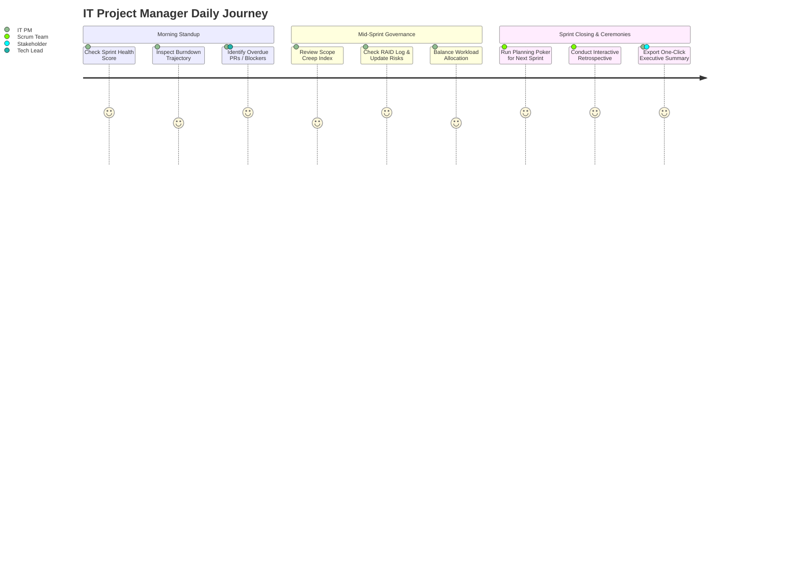

# Product Requirements Document (PRD)

## Project: SprintPulse - Agile Delivery Analytics & Ceremony Suite
**Document Version:** 1.0.0  
**Author:** Associate IT Project Manager  
**Target Release:** Release 1.0 (MVP)  
**Status:** In Review / Ready for Implementation  

---

## 1. Product Vision & Goals

### 1.1 Vision Statement
To empower IT Project Managers and Agile Scrum teams with real-time delivery visibility, predictive risk identification, and collaborative ceremony tools in a unified, intuitive dashboard.

### 1.2 Target User Personas

```
+-----------------------------------------------------------------------------------+
| PERSONA 1: Sarah Perera - Associate IT Project Manager                           |
| Goal: Wants to understand team sprint velocity, identify blockers early, and      |
|       generate stakeholder reports in minutes without manually merging Jira data. |
| Frustration: Spends 3+ hours per week building manual status slide decks.         |
+-----------------------------------------------------------------------------------+
| PERSONA 2: Kasun Jayasinghe - Agile Scrum Master                                  |
| Goal: Wants objective data during Daily Standups and Sprint Retrospectives to     |
|       facilitate constructive discussions around workflow bottlenecks.            |
| Frustration: Retrospectives lack follow-through on action items.                   |
+-----------------------------------------------------------------------------------+
| PERSONA 3: Ruwan Silva - VP of Engineering / Delivery Director                    |
| Goal: Needs a high-level health score across multiple project squads to ensure    |
|       deliveries are on track and client SLAs are honored.                        |
| Frustration: Unclear visibility on silent scope creep across offshore teams.      |
+-----------------------------------------------------------------------------------+
```

---

## 2. User Journey & Story Map



---

## 3. Functional Requirements (MoSCoW Prioritization)

### 3.1 Core Dashboard & Metrics Engine (Must Have)
- **FR-01 (Sprint Health Score):** The system shall compute an aggregate Sprint Health Index ($0-100$) based on:
  $$\text{Health Score} = 0.35 \times (\text{Burndown Adherence}) + 0.25 \times (\text{Predictability}) + 0.20 \times (100 - \text{Scope Creep}) + 0.20 \times (100 - \text{Blocker Penalty})$$
- **FR-02 (Burndown & Burnup Chart):** Interactive visualization displaying:
  - *Ideal Burndown Line:* Linear decrement from total committed points to 0.
  - *Actual Remaining Points Line:* Day-by-day remaining story points.
  - *Burnup Scope Line:* Total scope over time highlighting mid-sprint additions.
- **FR-03 (Velocity Trend Analysis):** Visualizes committed vs. completed story points across the last 3–5 sprints, computing the team's historical average velocity.
- **FR-04 (Scope Creep & Volatility Index):** Automatically computes the percentage of story points added after Sprint Day 1:
  $$\text{Scope Creep \%} = \left( \frac{\text{Points Added Mid-Sprint}}{\text{Initial Committed Points}} \right) \times 100$$
- **FR-05 (Cycle Time & Lead Time Distribution):** Shows average lead time from story creation to production delivery, split by phase (In Progress, Code Review, QA, Done).

### 3.2 Automated Risk & Bottleneck Radar (Must Have)
- **FR-06 (Overallocated Resource Alerts):** Detects team members assigned points exceeding $100\%$ of their sprint capacity threshold.
- **FR-07 (Code Review Bottleneck Detector):** Flags pull requests / user stories remaining in *Code Review* status for $> 48$ consecutive hours.
- **FR-08 (Unestimated Story Warning):** Flags active backlog items in the sprint with 0 or missing story point estimates.

### 3.3 Agile Ceremony Toolkit (Should Have)
- **FR-09 (Interactive Retrospective Board):** Allows team members to post, upvote, and categorize retro cards into:
  - *What went well* (Green)
  - *What could be improved* (Orange)
  - *Action items with assignees* (Blue)
- **FR-10 (Planning Poker Story Estimator):** Provides interactive Fibonacci card voting (1, 2, 3, 5, 8, 13, 21), simulates team votes, and calculates consensus / outlier deviations.
- **FR-11 (Interactive RAID Log Manager):** A tabular risk register allowing users to log Risks, Assumptions, Issues, and Dependencies with 5x5 Likelihood x Impact scoring.

### 3.4 Reporting & Exporting (Could Have)
- **FR-12 (Executive Stakeholder Summary Exporter):** Generates a formatted executive briefing document (Markdown / Print-to-PDF ready) summarizing Sprint KPIs, risks, key achievements, and retro action items.

---

## 4. User Stories & Acceptance Criteria (Gherkin Format)

### US-01: Real-time Burndown Tracking
> **As an** Associate IT Project Manager,  
> **I want to** view an interactive daily burndown chart,  
> **So that** I can forecast whether the team will hit their sprint commitment before sprint end.

```gherkin
Feature: Interactive Sprint Burndown Chart
  Scenario: Viewing on-track vs. delayed burndown trajectory
    Given the user is on the Sprint Dashboard tab
    When the active sprint data is loaded
    Then the chart displays the "Ideal Linear Burndown" guideline
    And the "Actual Remaining Story Points" line reflects daily completed work
    And a warning banner is shown if actual points exceed ideal points by > 20% on Day 7
```

### US-02: Automated Scope Creep Alert
> **As a** Scrum Master,  
> **I want** the system to calculate and flag mid-sprint scope changes,  
> **So that** I can prevent unapproved work from derailing sprint goals.

```gherkin
Feature: Scope Volatility Calculation
  Scenario: Detecting mid-sprint user story additions
    Given a sprint started with 40 committed story points
    When 8 additional story points are added on Day 4 of the sprint
    Then the Scope Creep Index should display "20.0%"
    And an alert badge "Moderate Scope Creep" should appear in the Risk Radar
```

---

## 5. Non-Functional Requirements (NFRs)

| NFR ID | Category | Requirement Specification |
| :--- | :--- | :--- |
| **NFR-01** | **Performance** | Initial dashboard load & chart render time $< 1.2\text{s}$ on standard 4G connections. |
| **NFR-02** | **Portability** | Zero server build dependency; fully executable as a static web bundle on GitHub Pages. |
| **NFR-03** | **Responsiveness**| Fully functional on desktop ($1920\times1080$), tablet ($1024\times768$), and mobile ($375\times812$). |
| **NFR-04** | **Usability / UI** | Modern glassmorphism UI adhering to WCAG 2.1 AA color contrast ratios with dark/light themes. |
| **NFR-05** | **Data Persistence**| Retrospective items, RAID log entries, and custom sprint data persisted in browser `localStorage`. |

---

## 6. Release Milestones

- **Sprint 1 (Weeks 1-2):** Core Architecture, Design Tokens, Metric calculation engine, Burndown & Velocity charts.
- **Sprint 2 (Weeks 3-4):** Risk Radar, Retrospective board, Planning Poker, RAID Log manager.
- **Sprint 3 (Weeks 5-6):** Stakeholder Executive Export, Multi-dataset switcher, Comprehensive Documentation & GitHub Pages deployment.
