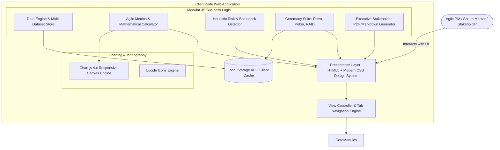
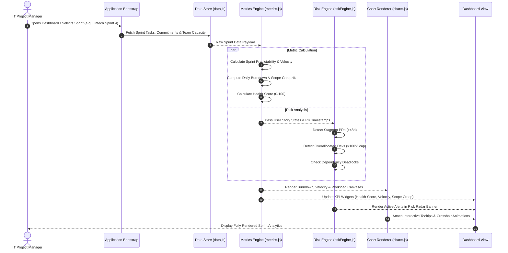

# System Architecture & Technical Specifications

**Project:** SprintPulse Agile Analytics Platform  
**Document Version:** 1.0.0  
**Architect:** Associate IT Project Manager / Full-Stack Engineer  
**Status:** Approved for Implementation  

---

## 1. System Overview

SprintPulse utilizes a modular, client-side single-page architecture (SPA) that operates with zero backend dependencies, allowing immediate evaluation via GitHub Pages while supporting local persistence through the Web Storage API.

---

## 2. C4 Model: Container & Component Architecture

### 2.1 C4 Level 2: Container Diagram

---

## 3. Data Flow & Metrics Computation Pipeline

---

## 4. Module Decomposition

### 4.1 `data.js` (State Management & Datasets)
- Encapsulates pre-configured sprint datasets:
  1. **Fintech Core Banking Team:** Highly regulated, strict velocity, dependency heavy.
  2. **E-Commerce Mobile Team:** High velocity, frequent scope volatility, rapid turnarounds.
  3. **Enterprise SaaS AI Team:** Research spikes, QA code review bottlenecks.
- Implements CRUD persistence layer backed by `localStorage`.

### 4.2 `metrics.js` (Mathematical Models)
- **Velocity Formula:**
  $$V_{\text{actual}} = \sum \text{Story Points of Stories with Status} = \text{"Done"}$$
- **Sprint Predictability Formula:**
  $$P = \min\left(100, \left(\frac{V_{\text{actual}}}{V_{\text{committed}}}\right) \times 100\right)$$
- **Burndown Slope ($\Delta P_{\text{day}}$):**
  $$\text{Ideal Remaining}_d = V_{\text{committed}} - \left( \frac{V_{\text{committed}}}{N_{\text{days}}} \times d \right)$$

### 4.3 `riskEngine.js` (Heuristic Risk Detection)
- Evaluates four primary risk vectors:
  1. **Resource Overload:** $\text{Assigned Points} > \text{Capacity}$.
  2. **Review Bottleneck:** $\text{Status} = \text{"In Review"} \land \text{Age} \ge 48\text{h}$.
  3. **Scope Volatility:** $\text{Points Added Mid-Sprint} > 0.15 \times \text{Initial Commitment}$.
  4. **Unestimated Work:** $\text{Story Point} = \text{null} \lor 0$.

### 4.4 `charts.js` (Canvas Visualizations)
- Configured with Chart.js with custom gradients, glassmorphism tooltips, dark-mode color palettes, and responsive aspect ratios.

---

## 5. Security & Browser Sandboxing

- **Zero Third-Party Backend Exfiltration:** All computations are strictly executed inside the client's browser sandbox.
- **Content Security:** Uses HTTPS-delivered CDN libraries with SRI integrity checks for Chart.js and Lucide Icons.
- **XSS Protection:** Sanitizes all input fields in Retrospective and RAID log before updating DOM tree.
