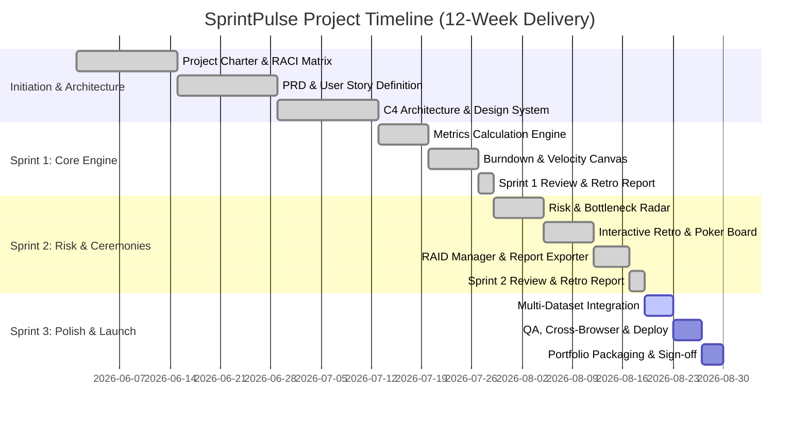

# Work Breakdown Structure (WBS) & Project Roadmap

**Project:** SprintPulse Agile Analytics Platform  
**Document Version:** 1.0.0  
**Manager:** Associate IT Project Manager  
**Methodology:** Hybrid Agile (Scrum with Stage-Gate Governance)  

---

## 1. Work Breakdown Structure (Hierarchical 4-Level)

```text
1.0 SprintPulse Platform
├── 1.1 Project Initiation & Requirements
│   ├── 1.1.1 Stakeholder Analysis & RACI Matrix Definition
│   ├── 1.1.2 Project Charter Formulation (PC-SP-2026)
│   ├── 1.1.3 Product Requirements Document (PRD & User Stories)
│   └── 1.1.4 Risk Management Planning & Initial RAID Register
├── 1.2 System Architecture & Design
│   ├── 1.2.1 C4 Architecture Modeling & Component Specifications
│   ├── 1.2.2 Design System Engineering (Design Tokens, Themes, Glassmorphism)
│   └── 1.2.3 Data Structure & Metric Calculation Mathematical Modeling
├── 1.3 Core Engineering & Module Development
│   ├── 1.3.1 Agile Metrics & Mathematical Engine (Velocity, Burndown, Volatility)
│   ├── 1.3.2 Responsive Chart.js Canvas Integration Layer
│   ├── 1.3.3 Heuristic Risk & Bottleneck Detection Engine
│   ├── 1.3.4 Interactive Retrospective Board Module
│   ├── 1.3.5 Planning Poker Estimation Module
│   └── 1.3.6 Interactive RAID Log Module & Executive Report Exporter
├── 1.4 Quality Assurance, Testing & Deployment
│   ├── 1.4.1 Cross-Browser Compatibility & Responsive Verification
│   ├── 1.4.2 Usability & Accessibility (WCAG 2.1 AA) Audit
│   ├── 1.4.3 CI/CD Automation & GitHub Pages Deployment Pipeline
│   └── 1.4.4 Sprint 1 & 2 Retrospective Reports Formulation
└── 1.5 Project Closure & Portfolio Packaging
    ├── 1.5.1 Final Executive Stakeholder Briefing
    └── 1.5.2 GitHub Repository Documentation & LinkedIn Portfolio Showcase
```

---

## 2. Release Roadmap & Gantt Timeline



---

## 3. Critical Path Analysis

The critical path encompasses:
1. **Requirements & PRD Approval (2 weeks)** $\rightarrow$
2. **Design Tokens & System Architecture (2 weeks)** $\rightarrow$
3. **Core Metrics & Charting Engine (2 weeks)** $\rightarrow$
4. **Ceremony Toolkit & Risk Radar (2 weeks)** $\rightarrow$
5. **QA & Automated Deployment Pipeline (1 week)**

Total Critical Path Duration: **9 Weeks** (with 3-week buffer for contingency reserve).

---

## 4. Stage-Gate Milestones

| Gate # | Milestone Name | Gate Criteria | Sign-Off Status |
| :--- | :--- | :--- | :--- |
| **Gate 1** | Requirements Baseline | PRD approved with MoSCoW priorities & SMART KPIs | **Approved** |
| **Gate 2** | Architecture Validation | C4 diagram, Data flow, and Zero-dependency architecture signed off | **Approved** |
| **Gate 3** | Sprint 1 Review (Alpha) | Live Burndown, Velocity chart, and Metric calculators verified | **Approved** |
| **Gate 4** | Sprint 2 Review (Beta)  | Retrospectives, Planning Poker, and Risk Radar functional | **Approved** |
| **Gate 5** | Release 1.0 General Availability | 100% test pass rate, documentation complete, GitHub Pages live | **Ready** |
